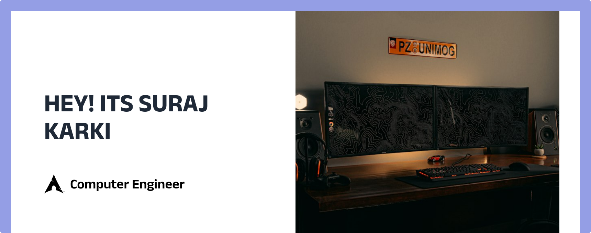

## Hi there 👋
I am a graduate computer engineer with a good understanding and hands-on experience in software development, artificial intelligence, and computer networks. Artificial intelligence, deep learning, and software development are my core strengths. I have some expertise in computer vision and generative AI and want to work on and improve myself in these domains in the future. I am looking for opportunities and collaborations in data science, deep learning, and software development projects.

## 🚀 Skills
   

 
<a href="https://postman.com" target="_blank" rel="noreferrer">     <a href="https://react.org" target="_blank" rel="noreferrer">  <a href="https://nodejs.org" target="_blank" rel="noreferrer"> <a href="https://www.mongodb.com" target="_blank" rel="noreferrer">    
 
 
     

------
### Connect with me

[][website]
[][youtube]
[][twitter]
[][linkedin]
[][instagram]

 

-----

 

[website]: https://surajkarki66.com.np
[twitter]: https://twitter.com/surajka16234107
[youtube]: https://www.youtube.com/channel/UCMvfiBrQZh0F81l64FzXOSA?view_as=subscriber
[linkedin]: https://www.linkedin.com/in/surajk66/

----
## Visitors Count - Since February 11, 2024
 
